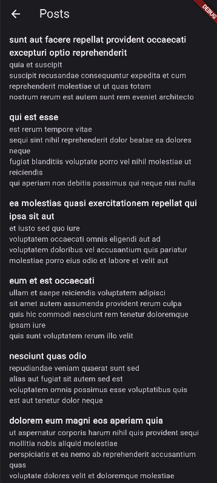

This repository contains a Flutter project implementing the BLoC pattern for managing state. The project consists of two main features: fetching and displaying images using the ImageBloc and fetching and displaying posts using the PostBloc.

### Installing

1. Clone the repository

2. Run the following command to get the required dependencies:

```
flutter pub get
```


3. Running the App

Use the following command to run the Flutter app on an emulator or connected device:

```
flutter run
```

4. Running Tests

To run tests for the project, use the following command:


```
flutter test
```

This will execute all the tests in the project.

Use and install the apk from the link

[Link](https://drive.google.com/file/d/13tiCYK80VCB9CErqM_XmOR8f6HfQI6ZB/view?usp=sharing)

### Screenshots



